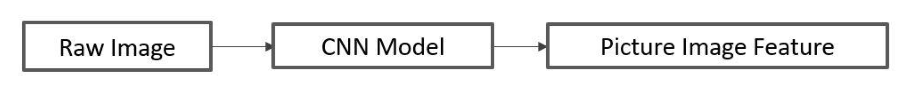
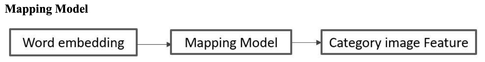
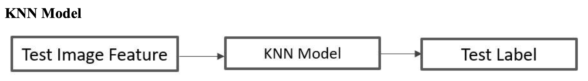

# README

The topic of project is related to zero shot learning. In the image classification task, zero shot learning means that the category in the test data set will not appear in the train data set.

The data source is coming from Alibaba Tian Chi competition. The data set contains three parts: train data set, test data set and word embedding. Train data set contains 365 classes and 151124 images and the corresponded label. Test data set contains 65 classes and 8025 images. Word embedding data set contains word embedding for all categories in both train and test data set. There is no overlap between train dataset and test dataset with respect to category.

In the zero shot learning, the whole task will be divided into three components: extracting image feature model, mapping between image feature and class attribute or class word embedding model and classification by KNN model.

There are two section:
- `Classification_Model`: to extract model
- `ZeroShot_Model`: achieve map between wordembedding and image feature and predict image label
NOTE: if you need the data, please download from https://tianchi.aliyun.com/competition/entrance/231677/information?lang=en-us

## Image Features Extraction
Raw image is original image with three channels. Picture image feature is a vector to represent specific image. Traditionally, picture image feature could be the last fully connected layer of classic classification model.

## Mapping
In this mapping model, the input is word embedding, which is vector to represent this category. Category image feature is also a vector to represent this category. In this situation, picture image feature is equal to category image feature. Because we assume that image features belong to same category are similar. During training phase, we use all picture image feature of train data set and correspond word embedding to train mapping model. After train this model, sending word embedding of test category, mapping model will predict category image feature for every test image category, which is a vector collection and we named it as TCIF(test category image feature). Because number of category for test data is 65, TCIF contains 65 vectors.

## KNN Model
In this model, the input is image feature and output is category label. We will use TCIF and correspond label to train KNN model. Then offering us an raw image, extract image feature by model 1 and sending this image feature to KNN model. KNN model will predict label for this image.

